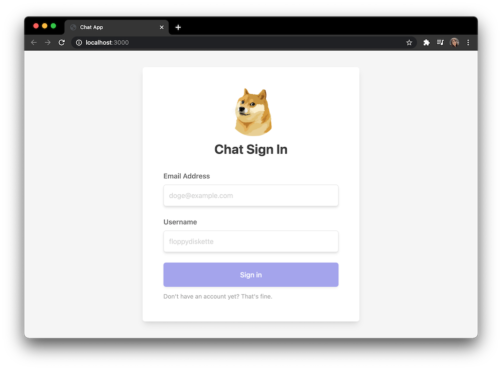
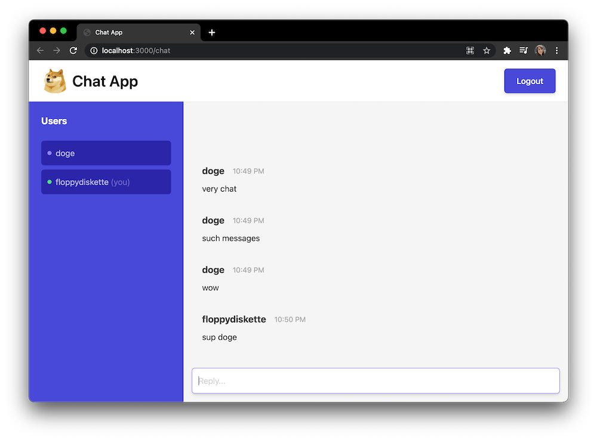

# Chat App

A chat application using React, Redux Toolkit, Socket.io, and Tailwind CSS.





## Setup

### Install dependencies

Install the dependencies for the client and server.

```bash
# in one terminal window
cd server && npm i
# in another terminal window
cd client && npm i
```

### Start server

An Express server is maintaining a Socket.io connection, persisting data short-term in memory, and exposes an API for accessing persistent data.

```bash
# in /server
npm start
```

> Server is running on `localhost:5000`.

### Start client

A React server with Redux for the front end.

```bash
# in /client
npm start
```

> Client dev server is running on `localhost:3000`.

You can view the app at `localhost:3000`. Log in with any valid email and username, and you'll enter into the chatroom, which will display all users (noting which are currently online) and all messages.

### Production build

Run `npm run build` on `client` and `server` to compile to JavaScript.

## Todos

- [ ] Duplicate users should be checked and not allowed
- [x] Add user is typing
- [ ] Allow tagging
- [ ] Add settings
- [ ] Add error handling
- [ ] Add tests
  - [ ] Jest Unit tests
  - [ ] React Testing Library component tests
  - [ ] Cypress end-to-end tests
- [ ] Add ESLint
- [x] Add Docker support
